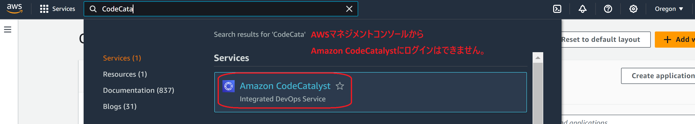
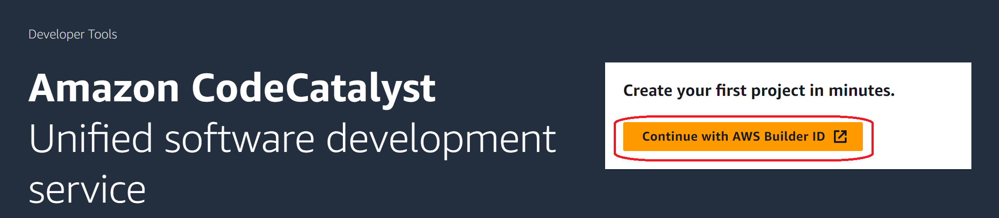
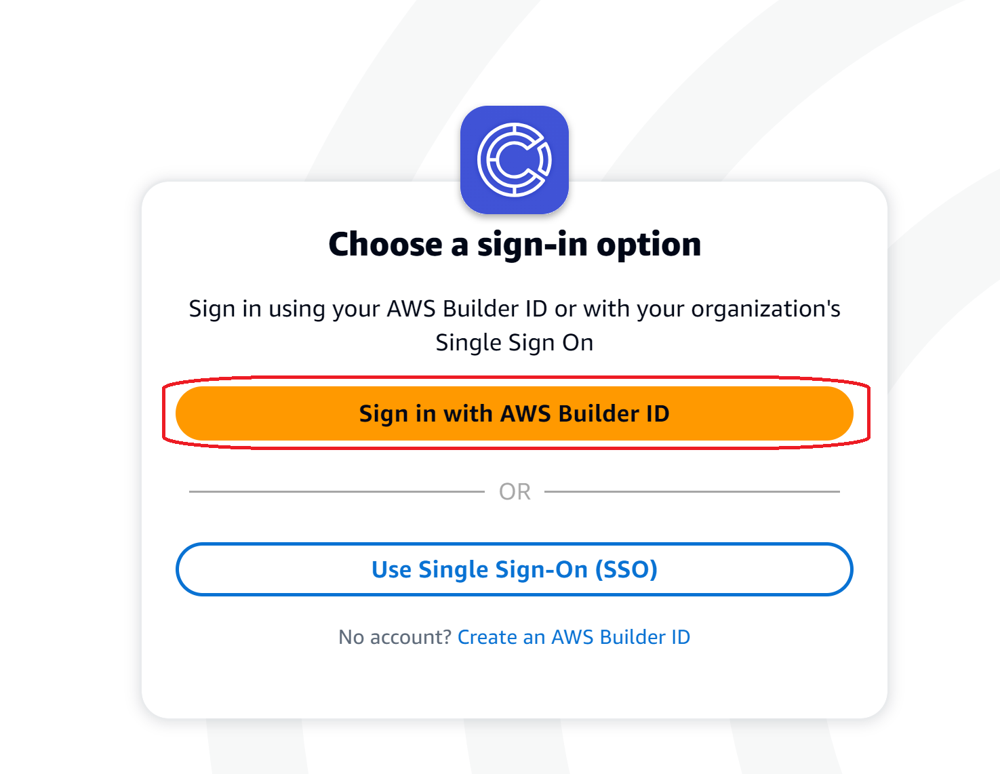
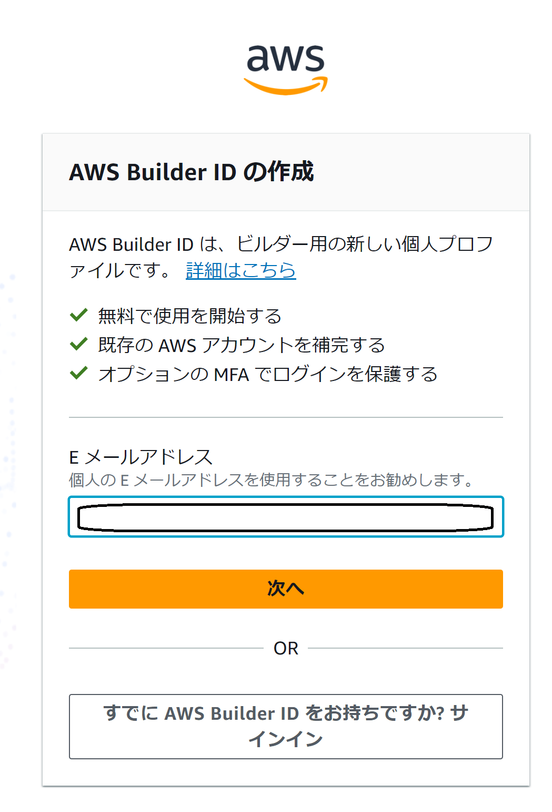
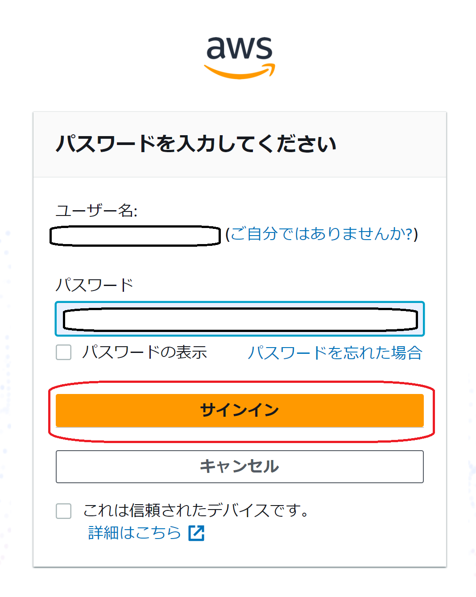
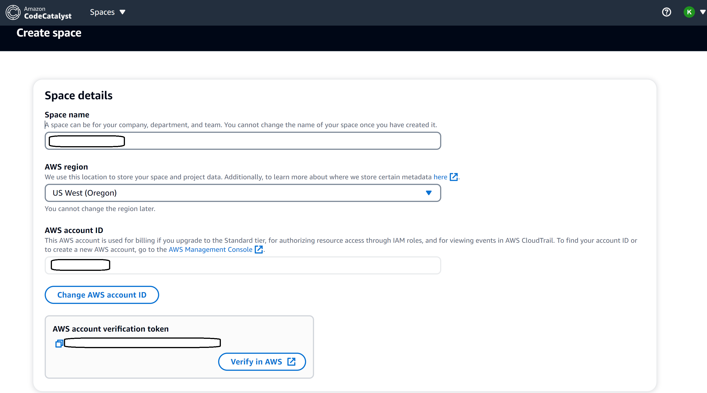

# Amazon CodeCatalystをセットアップする

## はじめに

この記事ではAmazon CodeCatalystをセットアップする方法について説明します。
誤りなどがあれば、修正してく予定です。

## 統合的なAWSのデベロッパーツールですか？Amazon CodeCatalystがありますよ

AWSのデベロッパーツールとして、CodeGuru、CodeCommit、CodeBuild、CodeDeploy、CodePipeline、CodeArtifact、CodeStar、CodeStar Connectionsなどがあります。

広い意味でとらえるとAWS CDKやAWS CLI、AWS SDKもデベロッパーツールかもしれません。
※CDKはいってしまえば、変な話、「AWSのクラウドインフラをプログラミングする」みたいなものです。AWS CLIをデプロイツールとして使ってデプロイすることもあるかもしれません。AWS SDKはいわずもがなです。

いずれにしても本格的なプロジェクト管理やCI/CDを実践するには、これらのツールを組み合わせて実現します。また、実現の過程で似たような構成を何度も作ることになるかもしれません。

たとえば、CodePipelineでCI/CDを実現する場合、CodeBuildでビルド、CodeDeployでデプロイ、CodeCommitでソースコードを管理することになります。もしくはGitHubのリポジトリかもしれません。これらの設定を必要になったタイミングで何度も繰り返すのは、とても大変です。

なお、これらのインフラ構築はCodeシリーズに限った話ではありません。たとえば、ECSやEKSのクラスターを構築する場合も、同様の問題が発生します。

そこで、Amazon CodeCatalystが登場します。

## Amazon CodeCatalystとは

Amazon CodeCatalystは、ソフトウェア開発プロセスに継続的インテグレーションとデプロイの方法を採用するソフトウェア開発チーム向けの統合サービスです。

[Amazon とは何ですか CodeCatalyst? - 参考](https://docs.aws.amazon.com/ja_jp/codecatalyst/latest/userguide/welcome.html)

用語については[過去の記事](https://qiita.com/ymd65536/items/778c8b21618a17f9d455)を参照してください。

利用には、AWSアカウントの他に、AWS Builder IDが必要です。
また、外部のリポジトリとしてGitHubを利用する場合は、GitHubのアカウントも必要です。
なお、IAM Identity Centerを利用してログインするこことも可能です。

## 前提

今回はAWS Builder IDとGitHubのアカウントを利用してセットアップします。
※IAM Identity Centerを利用した方法については後日、別の記事で紹介します。

必要なもの

- AWSアカウント
  - Admin相当の権限で利用できること
- AWS Builder ID
- GitHubのアカウント
  - 個人でも組織でも可（組織の場合はその組織のオーナーにリポジトリをCodeCatalystにリンクしても良いか聞いてね）

## Amazon CodeCatalystのセットアップ

まずは、AWSのマネジメントコンソールを開きます。
検索窓から「CodeCatalyst」を入力し、CodeCatalystを選択します。

なお、AWSのマネジメントコンソールからCodeCatalystにログインはできません。CodeCatalystのページにアクセスする必要があります。

## Continue with AWS Builder ID

AWS Builder IDでログインするため、[Continue with AWS Builder ID]をクリックします。

`Sign in with AWS Builder ID`をクリックします。

AWS Builder IDでログインします。今回は事前に登録しておいたメールアドレスとパスワードを入力します。

まずはメールアドレスを入力して、次へをクリックします。

つぎにパスワードを入力して、サインインをクリックします。

## スペースの作成

CodeCatalystではスペースを作成したのち、その中にプロジェクトを作成します。
プロジェクトにはリポジトリが含まれます。もちろん、ここにはGitHubのリポジトリをリンクできます。

では、スペースを作成します。
スペース名とAWSのアカウントIDを入力します。リージョンはオレゴンです。

`Verify in AWS`をクリックします。

スペースが作成されました。
